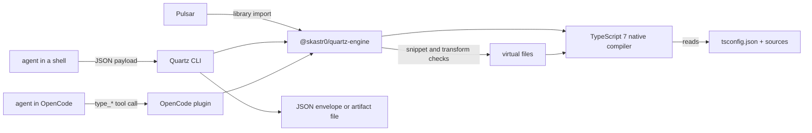

# Quartz

**Quartz answers an agent's TypeScript questions with the compiler's own answers.**

```bash
npm install -g @skastr0/quartz
```

## The pain

Your agent is changing TypeScript whose types it can't see.

- **It guesses types from text.** It greps for a declaration and rebuilds the type in its head, through generics and inference it can't see.
- **It finds out from `tsc`.** Write, run `tsc`, read the error, try again. Many turns go to flailing on type errors.
- **It rewrites what already exists.** Nothing tells it there's already a `User → UserDTO` function two files over.

## What Quartz does

Quartz keeps the TypeScript 7 native compiler open on your project and answers questions as JSON. Your agent checks a type, a snippet, or whether a converter already exists before it writes code, not after `tsc` fails.

| your agent wants to know | command | it gets back |
|---|---|---|
| what a type contains | `info`, `expand` | resolved members and signatures |
| whether code compiles | `check-snippet` | compiler errors with line and column; nothing is written to disk |
| whether a converter already exists | `transform-search` | matching functions, each checked by a test compile |
| whether a planned conversion is safe | `verify-contract` | each check, passed or failed, and one overall answer |

| Quartz **is** | Quartz **is not** |
|---|---|
| a JSON CLI and OpenCode plugin that agents call mid-task | a language server or editor extension |
| answers from the TypeScript compiler | a guess from text search |
| evidence that a type or change checks out | proof that the code is correct at runtime |

**Status:** 0.2.2, usable with known gaps. npm packages for macOS and Linux (arm64, x64). No Windows build. Needs a `tsconfig.json`.

## Quick start

Run these from any folder that has a `tsconfig.json`. The output below comes from a small project with `User` and `UserDTO` types.

```bash
# 1. Install
npm install -g @skastr0/quartz

# 2. See which TypeScript projects quartz finds
quartz packages

# 3. Ask what a type contains
quartz info '{"symbol":"User"}'

# 4. Check code before writing it
quartz check-snippet '{"code":"const u: User = { id: \"1\", name: \"Ada\" };"}'
```

Step 3 returns the resolved members:

```json
{"ok":true,"command":"info","data":{"name":"User","kind":"interface","location":{"file":"types/basic.ts","line":8},
 "properties":[{"name":"id","type":"string"},{"name":"name","type":"string"},{"name":"email","type":"string"}]}}
```

Step 4 catches the missing field without touching a file:

```json
{"ok":true,"command":"check-snippet","data":{"valid":false,"errors":[
 {"message":"Property 'email' is missing in type '{ id: string; name: string; }' but required in type 'User'.","line":1,"column":7}]}}
```

Or run it without installing: `npx -y @skastr0/quartz@latest packages`, or `bunx @skastr0/quartz packages`.

## Use

Is there already a function that turns a `User` into a `UserDTO`?

```console
$ quartz transform-search '{"from":"User","to":"UserDTO","verifiedOnly":true,"limit":2}'
toDTO(from: User): UserDTO        types/transforms.ts:30   verified
transform(input: User): UserDTO   types/transforms.ts:211  verified
```

Can `toDTO` convert a `User` here? Four checks, one answer.

```console
$ quartz verify-contract '{"from":"User","to":"UserDTO","symbol":"toDTO"}'
ok: true
compatibility  failed   User is not directly assignable to UserDTO; verified transform evidence can still satisfy a conversion contract.
snippet        skipped  Skipped because no snippet was provided.
diagnostics    passed   Package diagnostics are clean.
transform      passed   A compiler-verified transform satisfies the requested contract.
```

The direct assignment fails, but a verified converter exists, so the answer is yes.

Both outputs are trimmed from the JSON envelope. Every command takes a JSON payload inline, from a file (`@payload.json`), or from stdin (`-`). Agents can discover every command and payload with `quartz capabilities` and `quartz schema show <command>`.

All commands:

| area | commands |
|---|---|
| look up | `packages`, `symbols`, `info`, `expand`, `search`, `file`, `at-position` |
| evaluate | `eval`, `explain`, `compatible`, `check-snippet` |
| errors | `diagnostics`, `why-error` |
| relationships | `related`, `graph`, `refactor-preview` |
| evidence | `transform-search`, `verify-contract` |
| discovery | `capabilities`, `schema`, `examples`, `doctor` |

Payload fields, batch calls, artifacts, and error envelopes are in [docs/reference.md](docs/reference.md).

## How it works



`@skastr0/quartz-engine` opens one TypeScript 7 native compiler per project through its async API. Snippets and transform checks compile as temporary virtual files, so your files are never changed. The CLI reuses one compiler across a batch of payloads. The OpenCode plugin keeps it warm for the whole session and refreshes it when files change.

## OpenCode plugin

Load `@skastr0/quartz-opencode-plugin/server` in OpenCode. It exposes the same analysis as 19 `type_*` tools rooted at your workspace, with one compiler kept warm across calls. Tool list: [docs/reference.md#opencode-plugin](docs/reference.md#opencode-plugin).

## Known issues

- `check-snippet` doesn't resolve tsconfig path aliases (`paths`) in a snippet's own imports. Package imports work, and project types are already in scope without an import.

One-shot commands start a fresh compiler each time (0.7 to 2.8 s per command on Quartz's own repo). Use batch payloads or the OpenCode plugin for repeated calls. Quartz runs on a pinned TypeScript 7 nightly, so its output may change between releases.

## Where it fits

Quartz gives every agent in a TypeScript repo the same compiler facts. [Pulsar](https://github.com/skastr0/pulsar) builds its TypeScript scoring on `@skastr0/quartz-engine`. More at [castro.engineer/projects/quartz](https://castro.engineer/projects/quartz).

## Development

```bash
bun install
bun run verify
```

Architecture checks: [docs/architecture-fitness.md](docs/architecture-fitness.md). Performance: [docs/performance.md](docs/performance.md). Release process: [docs/publishing.md](docs/publishing.md).

## Contributing, security, license

Issues are the way in; see [CONTRIBUTING.md](CONTRIBUTING.md). Report vulnerabilities privately; see [SECURITY.md](SECURITY.md). MIT; see [LICENSE](LICENSE).
